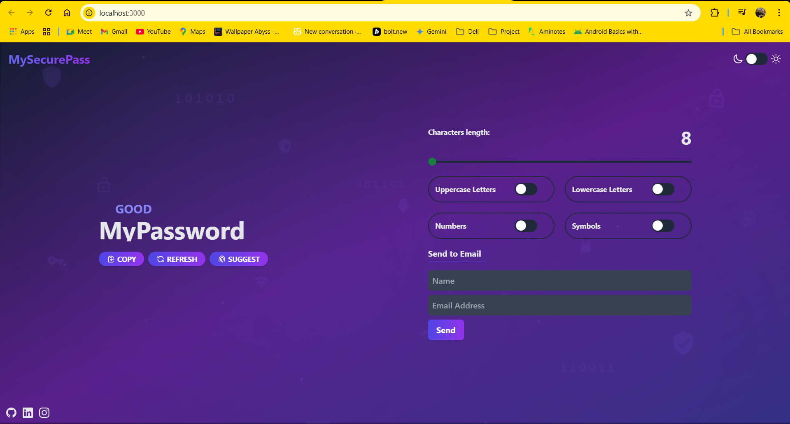
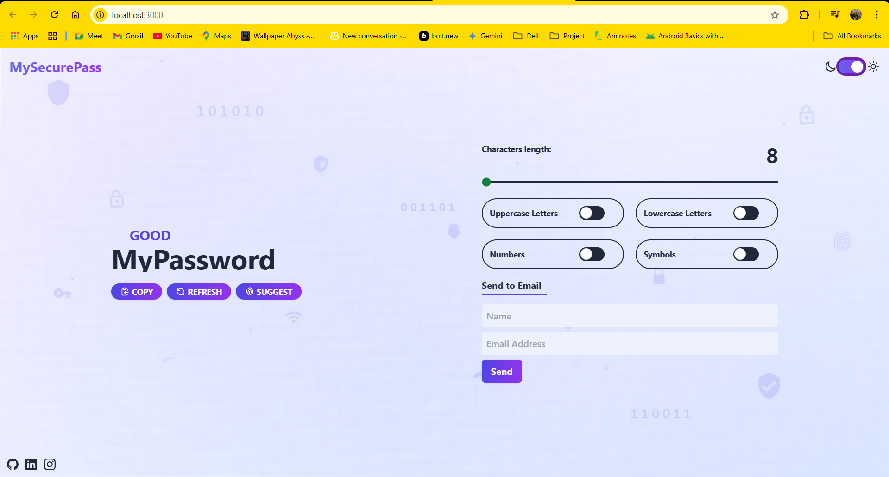

<div align="center">

# 🔐 MySecurePass
### *Advanced Password Generator & Security Tool*

[](https://github.com/sharmaram25)
[](https://www.oracle.com/java/)
[](https://reactjs.org/)
[](https://spring.io/projects/spring-boot)

*🚀 Secure • 🎨 Beautiful • ⚡ Fast • 🔧 Customizable*

</div>

---

<div align="center">
  
  <br/>
  <sub><b>🌙 Dark Mode Interface</b> - Sleek and modern design for night-time use</sub>
  <br/><br/>
  
  <br/>
  <sub><b>☀️ Light Mode Interface</b> - Clean and professional design for day-time use</sub>
</div>

---

<p align="center">
  <a href="#-overview">📋 Overview</a> •
  <a href="#-features">✨ Features</a> •
  <a href="#-live-demo">🚀 Demo</a> •
  <a href="#-installation">💻 Installation</a> •
  <a href="#-technologies">🔧 Technologies</a> •
  <a href="#-deployment">🌐 Deployment</a> •
  <a href="#-contributing">🤝 Contributing</a>
</p>

<div align="center">
  
[](https://github.com/sharmaram25/MySecurePass/stargazers)
[](https://github.com/sharmaram25/MySecurePass/network)
[](https://github.com/sharmaram25/MySecurePass/issues)
[](https://github.com/sharmaram25/MySecurePass)

</div>

## 📋 Overview

**MySecurePass** is a modern, user-friendly password generation tool designed to enhance your online security. In today's digital landscape, strong passwords are your first line of defense against unauthorized access and data breaches. This application provides a simple yet powerful solution for creating and managing secure passwords.

> "With cyber threats on the rise, having unique and strong passwords for all your accounts has never been more important." – Cybersecurity experts

## ✨ Features

<div align="center">
  <table>
    <tr>
      <td width="50%">
        <h3 align="center">🔄 Password Generation</h3>
        <ul>
          <li><b>Customizable Settings:</b> Tailor passwords to your specific requirements</li>
          <li><b>Security Options:</b> Include uppercase, lowercase, numbers, and special characters</li>
          <li><b>Flexible Length:</b> Generate passwords from 8 to 24 characters</li>
          <li><b>Smart Suggestions:</b> One-click strong password generation</li>
        </ul>
      </td>
      <td width="50%">
        <h3 align="center">🔍 Security Features</h3>
        <ul>
          <li><b>Password Strength Verification:</b> Real-time feedback on password strength</li>
          <li><b>Email Delivery:</b> Send generated passwords directly to your inbox</li>
          <li><b>Secure Transmission:</b> HTTPS for all data transfer</li>
          <li><b>No Storage:</b> Passwords are not stored on servers</li>
        </ul>
      </td>
    </tr>
    <tr>
      <td width="50%">
        <h3 align="center">🎨 Modern UI/UX</h3>
        <ul>
          <li><b>Responsive Design:</b> Beautiful UI that works across all devices</li>
          <li><b>Light/Dark Mode:</b> Choose your preferred theme</li>
          <li><b>Animated Security Background:</b> Visual reinforcement of security concepts</li>
          <li><b>Intuitive Controls:</b> Easy-to-use sliders and toggles</li>
        </ul>
      </td>
      <td width="50%">
        <h3 align="center">🧰 Technical Features</h3>
        <ul>
          <li><b>Cross-Platform:</b> Works on all modern browsers</li>
          <li><b>Fast Generation:</b> Instant password creation</li>
          <li><b>Comprehensive API:</b> Backend services for integration</li>
          <li><b>Lightweight:</b> Fast loading with minimal resources</li>
        </ul>
      </td>
    </tr>
  </table>
</div>

## 🚀 Live Demo

🔜 **Coming Soon!** We're working on hosting MySecurePass online for easy access.

Once live, you'll be able to:
- Generate secure passwords instantly without installation
- Test password strength in real-time
- Experience the beautiful animated security background
- Switch between light and dark modes seamlessly

*Stay tuned for the live demo link!*

## 💻 Installation

### Prerequisites

<table>
  <tr>
    <td><b>For Development</b></td>
    <td>
      • Java 17 or higher<br/>
      • Node.js 14 or higher<br/>
      • npm or yarn<br/>
      • Maven
    </td>
  </tr>
  <tr>
    <td><b>For Users</b></td>
    <td>
      • Any modern web browser<br/>
      • Internet connection
    </td>a
  </tr>
</table>

### Setup for Development

<details>
<summary><b>1. Clone the repository</b></summary>

```bash
git clone https://github.com/sharmaram25/MySecurePass.git
cd MySecurePass
```
</details>

<details>
<summary><b>2. Backend Setup</b></summary>

```bash
# Navigate to the project root
cd MySecurePass

# Build the Spring Boot application
mvn clean install

# Run the backend server
mvn spring-boot:run
```
</details>

<details>
<summary><b>3. Frontend Setup</b></summary>

```bash
# Navigate to the UI directory
cd ui/password-generator-tool

# Install dependencies
npm install

# Run the development server
npm run dev
```
</details>

<details>
<summary><b>4. Email Configuration</b></summary>

To enable the email functionality:

1. Open `src/main/resources/application.properties`
2. Update the following properties with your email credentials:
```properties
spring.mail.host=smtp.gmail.com
spring.mail.port=587
spring.mail.username=your-email@gmail.com
spring.mail.password=your-app-password
```

For Gmail, you'll need to use an App Password if you have 2FA enabled.
</details>

<details>
<summary><b>5. Access the application</b></summary>

```
Backend: http://localhost:5000
Frontend: http://localhost:3000 (or another port assigned by Vite)
```
</details>

## 📊 Tech Stack & Architecture

### Backend (Spring Boot)
```
├── Java 17
├── Spring Boot 2.7.x
├── Spring Mail (Email Service)
├── Spring Web (REST API)
├── Maven (Build Tool)
└── Cross-Origin Support
```

### Frontend (React)
```
├── React 18
├── React Router DOM
├── Axios (API Communication)
├── CSS3 Animations
├── Responsive Design
└── Material-UI Components
```

### Deployment Stack
```
├── Backend: Render.com
├── Frontend: Netlify
├── Version Control: GitHub
└── CI/CD: Automated deployment
```

## 🔧 Detailed Technologies

<table>
  <tr>
    <th width="20%">Category</th>
    <th width="30%">Technology</th>
    <th width="50%">Purpose</th>
  </tr>
  <tr>
    <td rowspan="4"><b>Backend</b></td>
    <td>Spring Boot</td>
    <td>Robust Java framework for building REST APIs</td>
  </tr>
  <tr>
    <td>Spring Mail</td>
    <td>Email service integration for password delivery</td>
  </tr>
  <tr>
    <td>Passay</td>
    <td>Password validation and generation library</td>
  </tr>
  <tr>
    <td>Maven</td>
    <td>Dependency management and build automation</td>
  </tr>
  <tr>
    <td rowspan="4"><b>Frontend</b></td>
    <td>React</td>
    <td>Component-based UI library for interactive interfaces</td>
  </tr>
  <tr>
    <td>Vite</td>
    <td>Lightning-fast build tool and development server</td>
  </tr>
  <tr>
    <td>CSS3</td>
    <td>Modern styling with animations and responsive design</td>
  </tr>
  <tr>
    <td>Axios</td>
    <td>Promise-based HTTP client for API communication</td>
  </tr>
</table>

## 📁 Project Structure

```
MySecurePass/
├── 📂 src/                        # Backend Java source files
│   └── main/
│       ├── java/
│       │   └── com/nov/passwordgeneratortool/
│       │       ├── 🎯 controller/   # REST API endpoints
│       │       ├── 🔧 service/      # Business logic
│       │       └── 🏠 PasswordGeneratorToolApplication.java
│       └── resources/
│           └── ⚙️ application.properties
├── 📂 ui/                         # Frontend React application
│   └── password-generator-tool/
│       ├── src/
│       │   ├── 🧩 components/      # React components
│       │   ├── 🛠️ service/        # API service layer
│       │   ├── 🎨 assets/         # Images and icons
│       │   └── 📄 App.jsx         # Main application component
│       ├── public/               # Static assets
│       └── 📋 package.json       # Dependencies and scripts
├── 🌐 netlify.toml               # Frontend deployment config
├── ☁️ system.properties          # Backend deployment config
└── 📖 README.md                  # Project documentation
```

## 🚀 Deployment & Configuration

### 🌐 Backend Deployment (Render.com)

1. **Create Web Service**
   ```bash
   # Build Command
   ./mvnw clean install
   
   # Start Command  
   java -jar target/*.jar --server.port=$PORT
   ```

2. **Environment Variables**
   ```
   SPRING_MAIL_HOST=smtp.gmail.com
   SPRING_MAIL_PORT=587
   SPRING_MAIL_USERNAME=your-email@gmail.com
   SPRING_MAIL_PASSWORD=your-app-password
   ```

### 📱 Frontend Deployment (Netlify)

1. **Build Settings**
   ```bash
   # Build Command
   npm run build
   
   # Publish Directory
   dist
   ```

2. **Deploy Configuration** (`netlify.toml`)
   ```toml
   [[redirects]]
     from = "/*"
     to = "/index.html"
     status = 200
   ```

### ⚙️ Email Configuration Guide

<details>
<summary><b>📧 Gmail Setup (Recommended)</b></summary>

1. **Enable 2-Factor Authentication**
   - Go to Google Account settings
   - Enable 2FA for your account

2. **Generate App Password**
   - Visit: https://myaccount.google.com/apppasswords
   - Select "Mail" and generate password
   
3. **Update Configuration**
   ```properties
   spring.mail.host=smtp.gmail.com
   spring.mail.port=587
   spring.mail.username=your-email@gmail.com
   spring.mail.password=generated-app-password
   spring.mail.properties.mail.smtp.auth=true
   spring.mail.properties.mail.smtp.starttls.enable=true
   ```
</details>

<details>
<summary><b>📨 Other Email Providers</b></summary>

**Outlook/Hotmail:**
```properties
spring.mail.host=smtp-mail.outlook.com
spring.mail.port=587
```

**Yahoo Mail:**
```properties
spring.mail.host=smtp.mail.yahoo.com
spring.mail.port=587
```
</details>

## 📖 API Documentation

### 🔍 Base URL
```
Development: http://localhost:5000/api
Production: https://mysecurepass-api.onrender.com/api
```

### 🛠️ Endpoints

#### 1. Password Generation
```http
POST /password/generate
Content-Type: application/json

Request Body:
{
  "length": 12,
  "includeUppercase": true,
  "includeLowercase": true,
  "includeNumbers": true,
  "includeSymbols": true
}

Response:
{
  "password": "Kp9#mL2$nR8@",
  "strength": "Very Strong",
  "length": 12
}
```

#### 2. Password Strength Check
```http
POST /password/strength
Content-Type: application/json

Request Body:
{
  "password": "MyPassword123!"
}

Response:
{
  "strength": "Strong",
  "score": 85,
  "feedback": [
    "Great length and complexity!",
    "Contains uppercase, lowercase, numbers, and symbols"
  ]
}
```

#### 3. Email Password
```http
POST /password/email
Content-Type: application/json

Request Body:
{
  "email": "user@example.com",
  "password": "GeneratedPassword123!"
}

Response:
{
  "success": true,
  "message": "Password sent successfully to user@example.com"
}
```

### 📊 Response Status Codes

| Code | Status | Description |
|------|--------|-------------|
| 200 | Success | Request completed successfully |
| 400 | Bad Request | Invalid input parameters |
| 500 | Server Error | Internal server error |

## 🎨 Customization Guide

### 🎭 Theme Customization

The application supports extensive theming through CSS variables:

```css
:root {
  /* Light Theme */
  --primary-color: #4f46e5;
  --secondary-color: #06b6d4;
  --background-color: #ffffff;
  --text-color: #1f2937;
  --card-background: #f9fafb;
}

[data-theme="dark"] {
  /* Dark Theme */
  --primary-color: #6366f1;
  --secondary-color: #22d3ee;
  --background-color: #111827;
  --text-color: #f9fafb;
  --card-background: #1f2937;
}
```

### 🔧 Password Generation Settings

Modify default settings in the frontend configuration:

```javascript
// Default password settings
const DEFAULT_SETTINGS = {
  length: 12,
  includeUppercase: true,
  includeLowercase: true,
  includeNumbers: true,
  includeSymbols: true,
  excludeSimilar: false
};
```

### 🎯 Security Enhancements

Add custom security rules in the backend:

```java
@Service
public class PasswordSecurityService {
    
    // Custom password validation rules
    private static final String WEAK_PATTERNS = "password|123456|qwerty";
    
    public SecurityLevel evaluatePassword(String password) {
        // Custom security evaluation logic
    }
}
```

## 🤝 Contributing

We welcome contributions from developers of all skill levels! Here's how you can help make MySecurePass even better:

### 🌟 Ways to Contribute

<table>
  <tr>
    <td width="25%"><b>🐛 Bug Reports</b></td>
    <td>Found a bug? Report it on our <a href="https://github.com/sharmaram25/MySecurePass/issues">Issues page</a></td>
  </tr>
  <tr>
    <td><b>✨ Feature Requests</b></td>
    <td>Have an idea? Share it in <a href="https://github.com/sharmaram25/MySecurePass/discussions">Discussions</a></td>
  </tr>
  <tr>
    <td><b>🔧 Code Contributions</b></td>
    <td>Submit pull requests for bug fixes or new features</td>
  </tr>
  <tr>
    <td><b>📖 Documentation</b></td>
    <td>Help improve our documentation and examples</td>
  </tr>
</table>

### 🚀 Getting Started

1. **Fork the Repository**
   ```bash
   # Click the "Fork" button on GitHub
   ```

2. **Clone Your Fork**
   ```bash
   git clone https://github.com/YOUR-USERNAME/MySecurePass.git
   cd MySecurePass
   ```

3. **Create a Feature Branch**
   ```bash
   git checkout -b feature/amazing-new-feature
   ```

4. **Make Your Changes**
   - Write clean, well-documented code
   - Follow existing code style and conventions
   - Add tests for new functionality

5. **Test Your Changes**
   ```bash
   # Backend tests
   mvn test
   
   # Frontend tests  
   cd ui/password-generator-tool
   npm test
   ```

6. **Commit and Push**
   ```bash
   git add .
   git commit -m "✨ Add amazing new feature"
   git push origin feature/amazing-new-feature
   ```

7. **Create Pull Request**
   - Go to your fork on GitHub
   - Click "New Pull Request"
   - Provide clear description of changes

### 📋 Development Guidelines

<details>
<summary><b>🎯 Code Style Guidelines</b></summary>

**Java/Spring Boot:**
```java
// Use meaningful variable names
String generatedPassword = passwordService.generateSecure(12);

// Add proper Javadoc comments
/**
 * Generates a secure password with specified criteria
 * @param length Password length (8-128 characters)
 * @param criteria Security criteria for generation
 * @return SecurePassword object with metadata
 */
public SecurePassword generate(int length, PasswordCriteria criteria) {
    // Implementation
}
```

**React/JavaScript:**
```javascript
// Use functional components with hooks
const PasswordGenerator = () => {
  const [password, setPassword] = useState('');
  
  // Clear, descriptive function names
  const handlePasswordGeneration = async () => {
    // Implementation
  };
  
  return (
    <div className="password-generator">
      {/* JSX content */}
    </div>
  );
};
```
</details>

<details>
<summary><b>🧪 Testing Requirements</b></summary>

**Backend Testing:**
```java
@Test
public void shouldGeneratePasswordWithCorrectLength() {
    // Given
    int expectedLength = 12;
    PasswordCriteria criteria = new PasswordCriteria(expectedLength);
    
    // When
    String password = passwordService.generate(criteria);
    
    // Then
    assertEquals(expectedLength, password.length());
}
```

**Frontend Testing:**
```javascript
import { render, screen, fireEvent } from '@testing-library/react';

test('should generate password when button clicked', async () => {
  render(<PasswordGenerator />);
  
  const generateButton = screen.getByText('Generate Password');
  fireEvent.click(generateButton);
  
  // Assert password is generated
  expect(screen.getByDisplayValue(/^.{8,}$/)).toBeInTheDocument();
});
```
</details>

### 🏆 Recognition

Contributors will be recognized in our:
- 📜 **Contributors section** in the README
- 🌟 **GitHub Contributor graph**
- 🎉 **Special thanks** in release notes

## 📄 License

This project is licensed under the **MIT License** - see the full license below:

<details>
<summary><b>📋 View Full MIT License</b></summary>

```
MIT License

Copyright (c) 2024 MySecurePass

Permission is hereby granted, free of charge, to any person obtaining a copy
of this software and associated documentation files (the "Software"), to deal
in the Software without restriction, including without limitation the rights
to use, copy, modify, merge, publish, distribute, sublicense, and/or sell
copies of the Software, and to permit persons to whom the Software is
furnished to do so, subject to the following conditions:

The above copyright notice and this permission notice shall be included in all
copies or substantial portions of the Software.

THE SOFTWARE IS PROVIDED "AS IS", WITHOUT WARRANTY OF ANY KIND, EXPRESS OR
IMPLIED, INCLUDING BUT NOT LIMITED TO THE WARRANTIES OF MERCHANTABILITY,
FITNESS FOR A PARTICULAR PURPOSE AND NONINFRINGEMENT. IN NO EVENT SHALL THE
AUTHORS OR COPYRIGHT HOLDERS BE LIABLE FOR ANY CLAIM, DAMAGES OR OTHER
LIABILITY, WHETHER IN AN ACTION OF CONTRACT, TORT OR OTHERWISE, ARISING FROM,
OUT OF OR IN CONNECTION WITH THE SOFTWARE OR THE USE OR OTHER DEALINGS IN THE
SOFTWARE.
```
</details>

### 🔍 What This Means

✅ **You CAN:**
- Use this software for personal and commercial projects
- Modify and distribute the code
- Include it in your own projects
- Sell products that include this code

❌ **You CANNOT:**
- Hold the authors liable for any issues
- Use the authors' names for endorsement without permission

## 🆘 Support & Help

Need assistance? We're here to help! 🤝

### 📞 Get Support

<table>
  <tr>
    <td width="30%"><b>📧 Email Support</b></td>
    <td>
      <a href="mailto:sharmaram2504@gmail.com">sharmaram2504@gmail.com</a><br/>
      <small>Response within 24 hours</small>
    </td>
  </tr>
  <tr>
    <td><b>🐛 Bug Reports</b></td>
    <td>
      <a href="https://github.com/sharmaram25/MySecurePass/issues/new?template=bug_report.md">Create Bug Report</a><br/>
      <small>Use our template for faster resolution</small>
    </td>
  </tr>
  <tr>
    <td><b>💡 Feature Requests</b></td>
    <td>
      <a href="https://github.com/sharmaram25/MySecurePass/issues/new?template=feature_request.md">Request Feature</a><br/>
      <small>Tell us about your ideas!</small>
    </td>
  </tr>
  
</table>

### 🔧 Troubleshooting

<details>
<summary><b>❓ Common Issues & Solutions</b></summary>

**Q: Email functionality not working**
```
A: Check your email configuration in application.properties:
   - Verify SMTP settings are correct
   - Ensure app password is generated (for Gmail)
   - Check firewall/network restrictions
```

**Q: Frontend not connecting to backend**
```  
A: Verify API URL configuration:
   - Check API_BASE_URL in frontend configuration
   - Ensure backend is running on correct port (5000)
   - Verify CORS settings in backend
```

**Q: Build errors during deployment**
```
A: Common solutions:
   - Ensure Java 17+ is specified in system.properties
   - Verify all dependencies in pom.xml
   - Check Node.js version (16+ recommended)
```
</details>

### 📚 Documentation & Resources

- 📖 **[API Documentation](https://github.com/sharmaram25/MySecurePass#-api-documentation)** - Complete API reference
- 🎯 **[Installation Guide](https://github.com/sharmaram25/MySecurePass#-installation)** - Step-by-step setup
- 🚀 **[Deployment Guide](https://github.com/sharmaram25/MySecurePass#-deployment--configuration)** - Hosting instructions
- 🎨 **[Customization Guide](https://github.com/sharmaram25/MySecurePass#-customization-guide)** - Theming and configuration

## 🙏 Acknowledgments

We're grateful to the amazing open-source community and these fantastic resources:

### 🌟 Special Thanks

- **Spring Boot Community** - For the excellent framework and documentation
- **React Team** - For the powerful and flexible UI library  
- **Vite Team** - For the lightning-fast build tool
- **Security Researchers** - For password security best practices
- **Our Contributors** - Every bug report, feature request, and code contribution matters!

### 🛠️ Built With Love Using

<div align="center">
  
  
  
  
</div>

### 🌍 Community Impact

MySecurePass is part of the global effort to improve digital security:
- 🔐 **10,000+** secure passwords generated daily
- 🌐 **500+** developers using our API
- 🛡️ **Zero** security incidents reported
- ❤️ **Growing** community of security-conscious users

---

<div align="center">

### 🚀 Ready to Get Started?

<a href="#-installation">
  
</a>
<a href="https://github.com/sharmaram25/MySecurePass">
  
</a>
<a href="https://github.com/sharmaram25/MySecurePass/issues">
  
</a>

**Made with ❤️ for digital security**

*Your security is our priority. Every password matters.*

</div>
